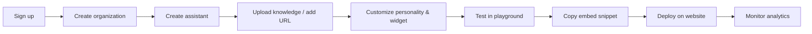

# Functional Specification

**Product:** ChatbotMaker (Genie)  
**Version:** 1.0  
**Status:** Draft  
**Document type:** Functional Requirements Document (FRD)

---

## 1. Purpose

This document defines **what** the platform must do — features, modules, user roles, journeys, and requirement structure. Technical implementation details are in [Technical architecture](./03-technical-architecture.md).

---

## 2. Scope

### In scope (MVP)

- Authentication and user management
- Organizations and workspaces
- AI assistant CRUD and configuration
- Knowledge base (document upload, chunking, indexing)
- Conversation engine with RAG and streaming
- Embeddable chat widget
- Basic analytics and usage tracking
- Stripe billing and plan limits
- Team invites and RBAC

### Out of scope (MVP, planned later)

- Voice AI, WhatsApp, Slack, Teams
- Workflow builder and multi-agent orchestration
- Marketplace and plugins
- MCP integration
- Mobile and desktop apps
- GitHub OAuth, 2FA (post-MVP)

---

## 3. User roles

| Role | Permissions |
|------|-------------|
| **Owner** | Full org control, billing, delete org, transfer ownership |
| **Admin** | Manage assistants, knowledge, team, settings |
| **Developer** | API keys, SDK, integrations, technical config |
| **Member** | View analytics, limited assistant access |
| **Support agent** | View conversations, provide feedback (future) |

---

## 4. User journey (happy path)



This mirrors the landing page's 3-step flow: **Connect content → Customize behavior → Embed & launch**.

---

## 5. Functional modules

### Module 1 — Authentication

| Feature | MVP | Notes |
|---------|-----|-------|
| Register (email/password) | ✅ | |
| Login | ✅ | |
| Forgot / reset password | ✅ | |
| Email verification | ✅ | |
| Google OAuth | ✅ | |
| GitHub OAuth | 🔲 | Post-MVP |
| Two-factor authentication | 🔲 | Post-MVP |
| Session management | ✅ | JWT + refresh tokens |

---

### Module 2 — Organization

| Feature | MVP | Notes |
|---------|-----|-------|
| Create organization | ✅ | |
| Delete organization | ✅ | Owner only |
| Invite members | ✅ | |
| Change owner | 🔲 | Post-MVP |
| Billing & subscription | ✅ | Stripe |
| Plan limits enforcement | ✅ | Per pricing tier |

---

### Module 3 — Workspace

| Feature | MVP | Notes |
|---------|-----|-------|
| Create workspace | ✅ | Optional grouping under org |
| Switch workspace | ✅ | |
| Workspace settings | ✅ | |
| API keys | ✅ | `pk_live_...` format per landing page |
| Secrets | 🔲 | For API integrations |

---

### Module 4 — AI Assistant

| Feature | MVP | Notes |
|---------|-----|-------|
| Create / update / delete assistant | ✅ | |
| System prompt & instructions | ✅ | |
| Personality & tone | ✅ | e.g. Professional, Friendly, Witty |
| Temperature & model selection | ✅ | Default: GPT-4o-mini or similar |
| Greeting message | ✅ | |
| Avatar & branding | ✅ | Pro: remove branding |
| Creativity slider | ✅ | UI shown on landing page |

---

### Module 5 — Knowledge base

| Feature | MVP | Notes |
|---------|-----|-------|
| Upload PDF | ✅ | Free: 1 PDF, 5MB |
| DOCX, TXT, Markdown, CSV | ✅ | Starter+ |
| Website URL | ✅ | Starter+ |
| Sitemap import | 🔲 | Phase 2 |
| Manual text / FAQ | ✅ | |
| Delete document | ✅ | |
| Reindex | ✅ | |
| Chunk documents | ✅ | Automatic |

---

### Module 6 — Website crawling

| Feature | MVP | Notes |
|---------|-----|-------|
| Crawl website | 🔲 | Phase 2 |
| Sitemap import | 🔲 | Phase 2 |
| Scheduled crawling | 🔲 | Phase 2 |
| Incremental sync | 🔲 | Phase 2 |
| Duplicate detection | 🔲 | Phase 2 |

---

### Module 7 — Conversation engine

| Feature | MVP | Notes |
|---------|-----|-------|
| Chat (REST) | ✅ | |
| Streaming (SSE) | ✅ | |
| Conversation memory | ✅ | Session + optional persistence |
| History | ✅ | |
| User feedback (thumbs up/down) | ✅ | |
| Regenerate response | ✅ | |
| Source citations | ✅ | RAG transparency |

---

### Module 8 — Widget

| Feature | MVP | Notes |
|---------|-----|-------|
| Theme (light/dark) | ✅ | |
| Position (bottom-right, etc.) | ✅ | |
| Colors & branding | ✅ | |
| Avatar & launcher bubble | ✅ | |
| Custom CSS (Pro) | 🔲 | |

Embed example (from landing page):

```javascript
const chatbot = new ChatBot({
  apiKey: 'pk_live_8392...',
  theme: 'dark'
});
```

---

### Module 9 — SDK

| Feature | MVP | Notes |
|---------|-----|-------|
| JavaScript SDK | ✅ | |
| React SDK | 🔲 | Phase 2 |
| REST SDK / OpenAPI client | ✅ | |
| Mobile SDK | 🔲 | Future |

---

### Module 10 — API function calling

| Feature | MVP | Notes |
|---------|-----|-------|
| Define REST endpoints | 🔲 | Phase 2 |
| Auth headers & variables | 🔲 | |
| Response mapping | 🔲 | |
| Test in playground | 🔲 | |

---

### Module 11 — AI actions

| Feature | MVP | Notes |
|---------|-----|-------|
| Execute API | 🔲 | Phase 2 |
| Trigger webhook | 🔲 | Phase 2 |
| Create support ticket | 🔲 | Phase 3 |
| CRM update | 🔲 | Phase 3 |
| Send email | 🔲 | Phase 3 |
| Custom actions | 🔲 | Phase 3 |

---

### Module 12 — Analytics

| Feature | MVP | Notes |
|---------|-----|-------|
| Conversation count | ✅ | |
| Message / AI request usage | ✅ | Plan limits |
| Document stats | ✅ | |
| Popular questions | 🔲 | Phase 2 |
| Knowledge gaps | 🔲 | Phase 2 |
| Customer satisfaction | 🔲 | Phase 2 |
| API action tracking | 🔲 | Phase 2 |

---

### Module 13 — Billing

| Feature | MVP | Notes |
|---------|-----|-------|
| Stripe integration | ✅ | |
| Plans: Free, Starter, Pro, Enterprise | ✅ | |
| Upgrade / downgrade | ✅ | |
| Usage limits | ✅ | Messages, bots, uploads |
| Overage billing | 🔲 | Phase 2 |
| Invoices | ✅ | Via Stripe portal |

#### Plan limits (aligned with landing page)

| Limit | Free | Starter | Pro | Enterprise |
|-------|------|---------|-----|------------|
| Chatbots | 1 | 1 | 3 | Custom |
| Messages / month | 50 | 1,000 | 5,000 | Custom |
| PDF upload | 1 (5MB) | Unlimited | Unlimited | Unlimited |
| URL upload | ❌ | ✅ | ✅ | ✅ |
| Branding removal | ❌ | ❌ | ✅ | ✅ |
| Analytics | Basic | Basic | Advanced | Custom |
| Support | Standard | Standard | Priority | Dedicated |

---

### Module 14 — Team management

| Feature | MVP | Notes |
|---------|-----|-------|
| Invite user | ✅ | Email invite |
| Remove user | ✅ | |
| Role assignment | ✅ | Owner, Admin, Developer, Member |
| Granular permissions | 🔲 | Phase 2 |

---

### Module 15 — Settings

| Feature | MVP | Notes |
|---------|-----|-------|
| Org branding | ✅ | |
| Custom domain (widget) | 🔲 | Phase 3 |
| API settings | ✅ | |
| Webhooks | 🔲 | Phase 2 |
| Security (session timeout, etc.) | ✅ | |

---

## 6. Functional requirement template

Each feature will be documented with a consistent ID (target: 150–200 requirements). Example:

### FR-001 — Create AI assistant

| Field | Value |
|-------|-------|
| **Description** | Authenticated users can create an AI assistant within their organization |
| **Preconditions** | User logged in; organization exists; plan allows assistant creation |
| **Input** | Name, description, model, prompt, avatar |
| **Processing** | Validate fields → create record → generate unique ID → store config |
| **Output** | Assistant created; visible in dashboard; editable; available for chat |
| **Errors** | Duplicate name, validation failure, plan limit exceeded |
| **Acceptance criteria** | Assistant appears in list; playground works immediately |

---

## 7. Non-functional requirements

| Category | Requirement |
|----------|-------------|
| **Performance** | Chat first token &lt; 2s; API p95 &lt; 500ms (non-AI) |
| **Security** | HTTPS, JWT, RBAC, tenant isolation, input validation |
| **Scalability** | Horizontal ECS scaling; stateless API |
| **Availability** | 99.9% target (post-MVP) |
| **Reliability** | Graceful AI provider fallback messaging |
| **Maintainability** | Modular NestJS; typed TypeScript throughout |
| **Accessibility** | WCAG 2.1 AA for dashboard and widget |
| **Monitoring** | Structured logs, error tracking, usage metrics |
| **Backup** | Daily MongoDB snapshots; S3 versioning |
| **Compliance** | GDPR-ready data export/delete (roadmap) |

---

## 8. Constraints & assumptions

### Constraints

- MVP uses OpenAI as sole LLM provider
- Single-region deployment (AWS + MongoDB Atlas)
- Monolithic NestJS API (not microservices) for MVP

### Assumptions

- Users have modern browsers (Chrome, Firefox, Safari, Edge)
- Stripe available in target markets
- OpenAI API remains stable and cost-predictable

---

## 9. Future enhancements

- Voice AI
- WhatsApp, Slack, Microsoft Teams channels
- Plugin marketplace
- MCP (Model Context Protocol)
- Workflow builder
- Multi-agent system
- Bring-your-own OpenAI API key (FAQ on landing page)
