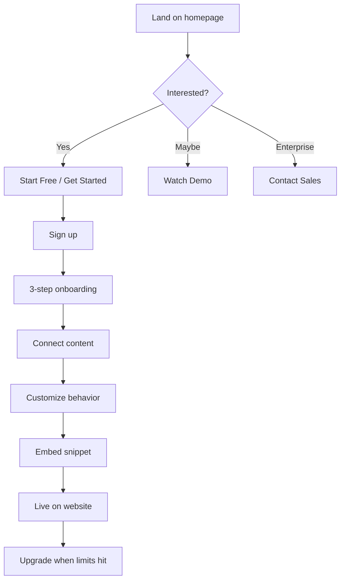

# Brand & Go-to-Market

**Product:** ChatbotMaker  
**Version:** 1.0  
**Status:** Aligned with live landing page  
**URL:** [aichatbotmaker.vercel.app](https://aichatbotmaker.vercel.app)

---

## 1. Brand identity

| Element | Value |
|---------|-------|
| **Product name** | ChatbotMaker |
| **Internal codename** | Genie (code only — not customer-facing) |
| **Tagline** | Custom ChatGPT for Your Website |
| **Hero headline** | AI Assistant That Understands Your Business |
| **Hero subtext** | Train, customize, and deploy intelligent chatbots in minutes. Seamlessly integrate with your website, app, or product. |
| **Category label** | AI-Powered Customer Support |

### Brand voice

- **Confident** but approachable
- **Developer-friendly** without alienating non-technical users
- **Action-oriented** — "deploy in minutes", "one-line install"
- **Trust-building** — security FAQ, transparent pricing

---

## 2. Value proposition

### Primary message

> Give your website AI superpowers without hiring an AI team.

### Three pillars (from landing page)

| Pillar | Message |
|--------|---------|
| **Train on your content** | Upload PDFs, docs, or auto-crawl your website. AI learns exclusively from your data. |
| **Custom personality** | Fine-tune voice, style, and behavior. Make the assistant feel like your brand. |
| **One-line installation** | Copy a snippet. Your AI assistant goes live in seconds. |

### Secondary message

> Add AI superpowers to your existing stack — no rewrite required.

---

## 3. Customer journey (marketing)



---

## 4. Landing page audit

Based on [aichatbotmaker.vercel.app](https://aichatbotmaker.vercel.app) as of July 2026.

### What's working well

| Section | Assessment |
|---------|------------|
| Hero | Clear value prop + dual CTA (Start Free, Watch Demo) |
| Code snippet preview | Speaks to developers; shows `apiKey`, `theme`, `brandVoice` |
| Feature grid | 4 strong cards with "Learn more" |
| 3-step process | Matches product workflow exactly |
| Pricing | 4 tiers, clear limits, "Most Popular" on Pro |
| FAQ | Addresses no-code, security, BYOK, training, UI customization |
| Contact | Email, phone, contact form |
| Visual design | Dark theme, modern, professional |

### Gaps to address (when building product)

| Gap | Recommendation |
|-----|----------------|
| "Start Free" not connected to app | Link to `/signup` when dashboard is live |
| "Watch Demo" | Add demo video or interactive playground embed |
| "Learn more" links | Point to docs or feature sub-pages |
| Contact form | Wire to backend (email or CRM) |
| FAQ answers truncated on fetch | Ensure full FAQ content is visible on page |
| Domain | Move from `aichatbotmaker.vercel.app` to custom domain |
| Legal pages | Add Privacy Policy, Terms of Service before launch |
| Social proof | Add testimonials, logos, or usage stats when available |

---

## 5. Pricing & packaging

Aligned with live landing page. Engineering must enforce these limits in [Billing module](./02-functional-specification.md#module-13--billing).

### Free — $0

**Positioning:** Perfect for experimentation and small personal projects.

- 1 Chatbot
- 50 Messages / month
- Upload 1 PDF (up to 5MB)
- Standard Support

**CTA:** Start Free

---

### Starter — $15/month

**Positioning:** Built for developers and early-stage projects.

- 1 Chatbot
- 1,000 Messages / month
- PDF & URL uploads
- Basic usage analytics
- Standard Support

**CTA:** Get Started

---

### Pro — $49/month ⭐ Most Popular

**Positioning:** Designed for startups and growing businesses.

- 3 Chatbots
- 5,000 Messages / month
- Unlimited PDF & URL uploads
- Remove branding
- Advanced analytics & usage tracking
- Priority Support

**CTA:** Get Started

---

### Enterprise — Custom

**Positioning:** High-volume teams and mission-critical workflows.

- Custom limits
- Dedicated support
- SLA options
- SSO, compliance (roadmap)

**CTA:** Contact Sales

---

### Pricing principles

- Simple pricing, no hidden costs
- Upgrade or downgrade anytime
- Usage limits drive upgrades naturally
- Pro tier is the revenue anchor ("Most Popular")

---

## 6. Target audience messaging

| Audience | Message | Channel |
|----------|---------|---------|
| **Small business owners** | "Answer customer questions 24/7 without hiring support staff" | SEO, social, local business groups |
| **Developers / indie hackers** | "One API key, one script tag — AI on your site in 5 minutes" | Dev Twitter/X, Product Hunt, Hacker News |
| **SaaS founders** | "Reduce support tickets with an AI trained on your docs" | SaaS communities, newsletters |
| **Agencies** | "Deploy AI assistants for every client from one dashboard" | Agency networks, LinkedIn |
| **Enterprise** | "Secure, scalable AI with custom limits and dedicated support" | Outbound sales, demos |

---

## 7. Competitive positioning

### vs. simple chatbot builders (Tidio, basic Chatbase)

**We win on:** RAG quality, developer APIs, action capabilities (roadmap), pricing transparency.

### vs. developer platforms (Botpress, Dify)

**We win on:** Ease of use, faster time-to-value, hosted SaaS (no self-hosting).

### vs. enterprise (Intercom Fin, Zendesk AI)

**We win on:** Price, speed of setup, no vendor lock-in to existing helpdesk.

### Positioning statement

> ChatbotMaker is the sweet spot between "dead-simple chatbot widget" and "enterprise AI platform" — developer-friendly, business-accessible, and priced for growth-stage companies.

---

## 8. FAQ alignment (product must deliver)

These promises appear on the landing page FAQ:

| FAQ question | Product requirement |
|--------------|---------------------|
| Do I need to know how to code? | No-code dashboard for setup; code optional for embed |
| Is my data secure? | Multi-tenant isolation, encryption, privacy policy |
| Can I bring my own OpenAI API key? | Phase 2 feature — org-level BYOK setting |
| How do I train the chatbot? | Upload docs, add URLs, crawl site |
| Can I customize the UI? | Widget theme, colors, position, avatar; Pro removes branding |

---

## 9. Contact & support

| Channel | Value |
|---------|-------|
| Email | hello@chatbotmaker.com |
| Phone | +91 7306162979 |
| Contact form | On landing page (footer CTA section) |

### Support tiers by plan

| Plan | Support level |
|------|---------------|
| Free | Standard (email, docs) |
| Starter | Standard |
| Pro | Priority (faster response SLA) |
| Enterprise | Dedicated account manager |

---

## 10. Domains & URLs (recommended)

| Purpose | URL |
|---------|-----|
| Marketing | `https://chatbotmaker.com` |
| App / dashboard | `https://app.chatbotmaker.com` |
| API | `https://api.chatbotmaker.com` |
| Widget CDN | `https://cdn.chatbotmaker.com` |
| Docs | `https://docs.chatbotmaker.com` |
| Status page | `https://status.chatbotmaker.com` |

**Current:** `aichatbotmaker.vercel.app` — suitable for pre-launch; migrate before paid marketing spend.

---

## 11. Launch checklist (GTM)

### Pre-launch

- [ ] Custom domain + SSL
- [ ] Privacy Policy + Terms of Service
- [ ] Cookie consent (if EU traffic expected)
- [ ] Working signup from all CTAs
- [ ] Stripe live mode (not test)
- [ ] Support email monitored
- [ ] Demo video or live playground

### Launch day

- [ ] Product Hunt launch
- [ ] Social announcement
- [ ] Email waitlist (if collected)
- [ ] Monitor Sentry + uptime

### Post-launch (30 days)

- [ ] Collect user feedback
- [ ] Add 2–3 testimonials to landing page
- [ ] SEO blog: "How to add AI chat to your website"
- [ ] Iterate pricing based on conversion data

---

## 12. Code vs. marketing naming

The landing page shows two embed examples:

```javascript
// Hero section
const genie = new Genie({
  apiKey: "pk_live_...",
  theme: "dark",
  brandVoice: "friendly",
  knowledgeBase: "https://docs.acme.com"
});

// Step 3 section
const chatbot = new ChatBot({
  apiKey: 'pk_live_8392...',
  theme: 'dark'
});
```

**Recommendation for implementation:**

| Context | Use |
|---------|-----|
| npm package | `@chatbotmaker/widget` |
| Global JS class | `ChatbotMaker` or `ChatBot` (pick one, deprecate the other) |
| Internal codename | `genie` — avoid in public SDK |
| API keys | `pk_live_...` (public), `sk_live_...` (secret, server-side) |

Standardize on **one** embed API before publishing SDK docs.
